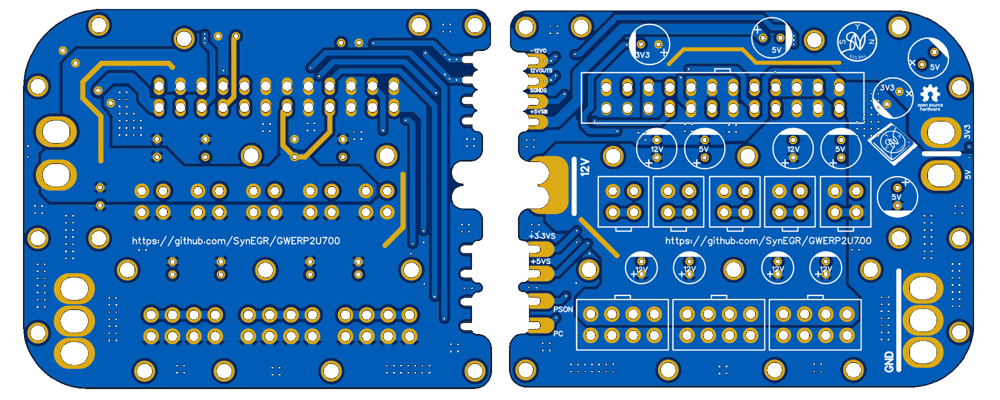
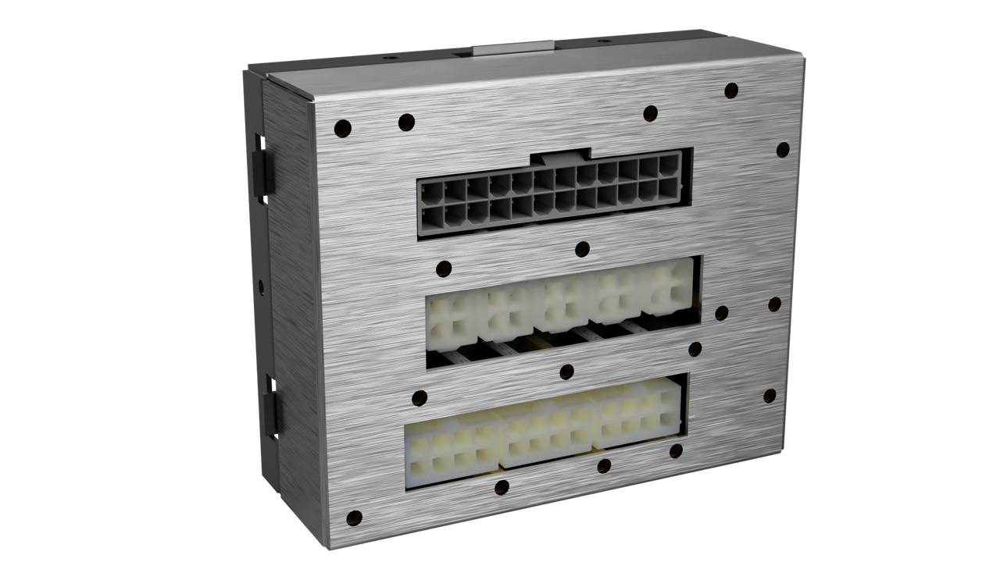
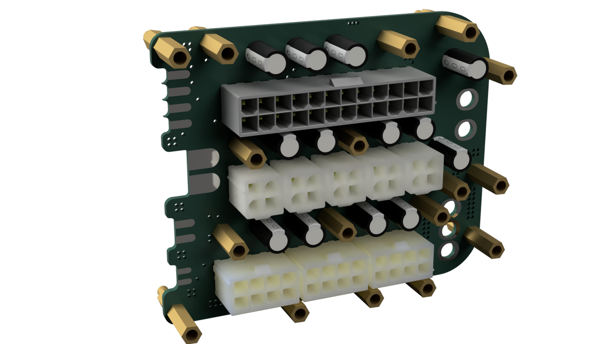
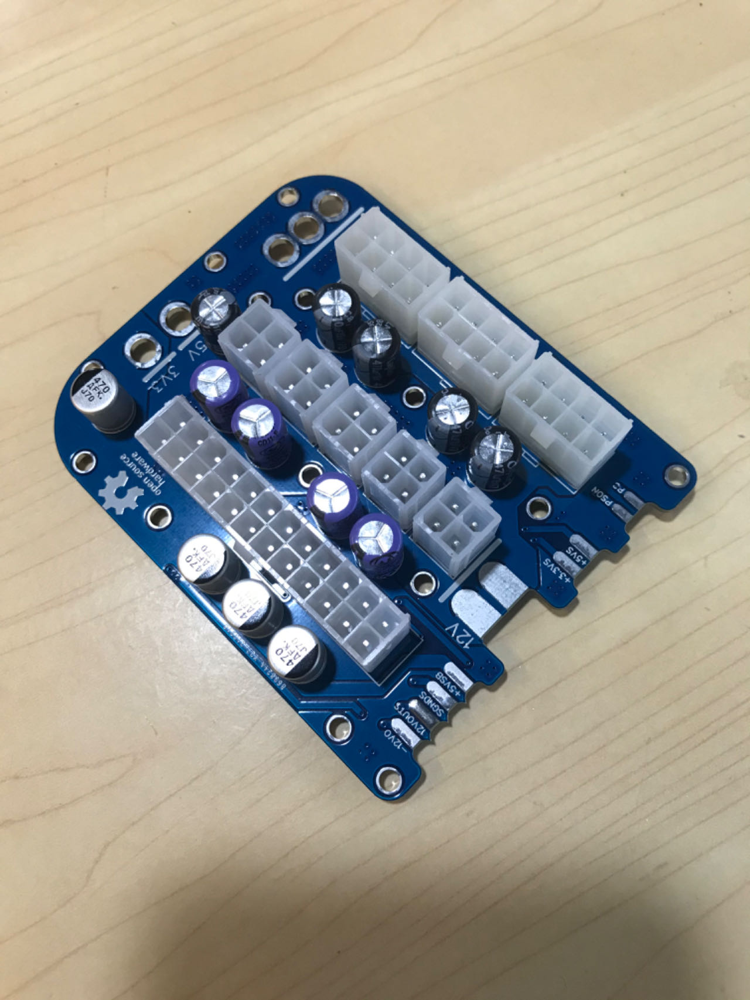
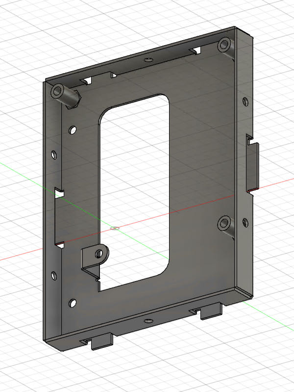
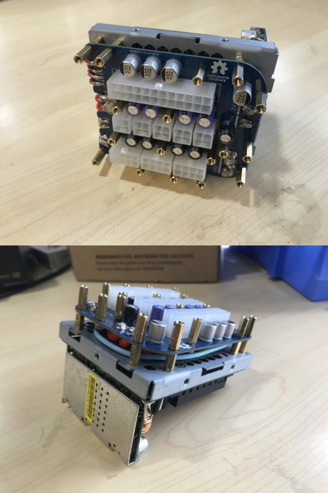
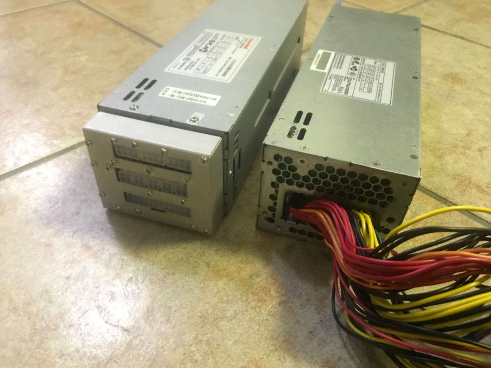
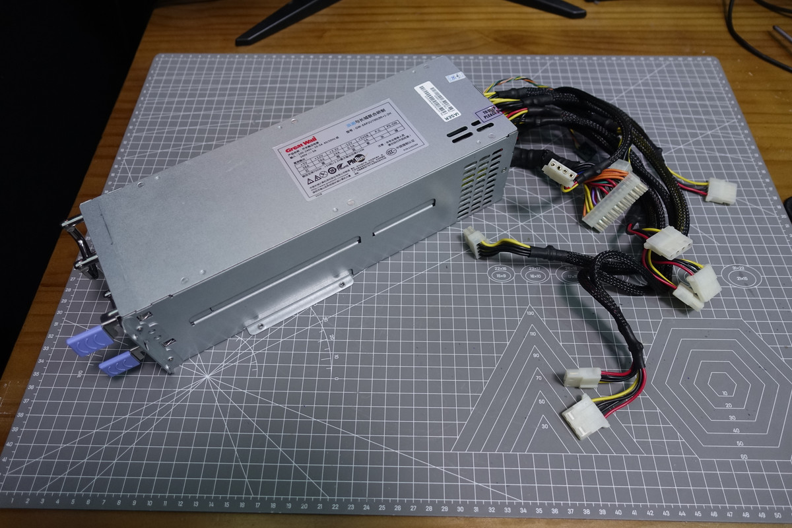

# GW-ERP2U700改全模组

长城ERP2U700电源改全模组。早期瞎折腾作品。这款电源本来性价比就很高，而且常规机架机箱一般都能装。唯一的缺憾是24pin实在太短，所以当初萌生了改全模组的念头。其实最后没实用，因为发现压模组线太费劲了 (难绷)，钣金外壳实际公差没控制好，而且也会和母座卡扣干涉，纯停留在样子货阶段就弃坑了，供大家参考交流吧，谨慎复刻。钣金部分使用 Fusion360 设计，附件有源文件以及导出的 step 版本与 stl 版本。

